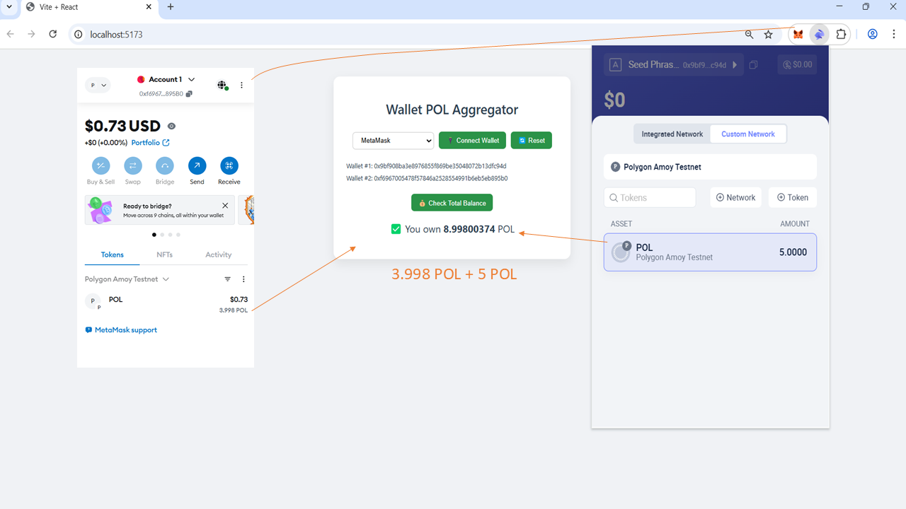

# WalletAggregator


> *Example: The app connects two wallets (MetaMask and Rabby) and displays the aggregated POL balance (e.g., 3.998 + 5 = 8.998 POL).*


**WalletAggregator** is an application that enables users to aggregate wallet balances and retrieve metadata from blockchain networks. It consists of a **frontend** (React + Vite) and a **backend** (ASP.NET Core).

---

## 🚀 Features

### 🛠 Backend
- **API Endpoints**:
  - `GET /api/wallet/balance`: Fetch balance of a single wallet.
  - `POST /api/wallet/aggregate`: Aggregate balances of multiple wallets.
  - `GET /api/wallet/metadata`: Retrieve network metadata.
- **Technologies**:
  - ASP.NET Core (.NET 8)
  - Nethereum (Ethereum interactions)
  - Swagger (automatic API documentation)

### 💻 Frontend
- **Wallet Integration**:
  - Supports MetaMask and Rabby Wallet.
- **Features**:
  - Connect one or two wallets.
  - Aggregate total POL balance across selected addresses.
- **Technologies**:
  - React with Vite
  - ethers.js for blockchain interactions

---

## 📁 Project Structure

```
WalletAggregator/
├── Backend/
│   ├── Controllers/
│   ├── Models/
│   ├── Program.cs
│   ├── appsettings.json
│   └── WalletAggregator.csproj
├── Frontend/
│   ├── src/
│   ├── public/
│   ├── vite.config.js
│   └── package.json
└── README.md
```

---

## 🧩 Prerequisites

### Backend
- [.NET SDK 8.0](https://dotnet.microsoft.com/en-us/download)
- Visual Studio, Rider or any code editor with C# support

### Frontend
- [Node.js (>= 16.x)](https://nodejs.org/)
- npm or another Node package manager (e.g. Yarn)

---

## ⚙️ Installation & Setup

### 1. Backend Setup

```sh
cd WalletAggregator
dotnet restore
dotnet run
```

- The backend should now be running at: [http://localhost:5143](http://localhost:5143)  
- Swagger UI available at: [http://localhost:5143/swagger](http://localhost:5143/swagger)

---

### 2. Frontend Setup

```sh
cd Frontend
npm install
npm run dev
```

- The frontend should now be available at: [http://localhost:5173](http://localhost:5173)

---

## 🧪 Usage

1. Start the backend and frontend as described above.
2. Open the frontend in your browser.
3. Connect one or two wallets (MetaMask or Rabby).
4. View and aggregate the total POL token balance.
5. Use the backend API directly via Swagger for testing or integration.

---
